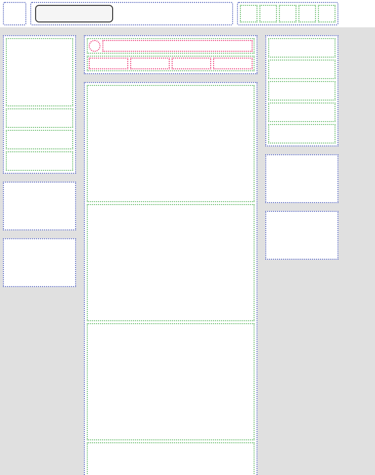

# Adding the rest
Now that we've worked on the base layouts of these popular sites, it's time to take it a step further and start adding in the smaller details

## Instructions
- Recreate the layouts from the screenshots below
- Add the components to each section of the layout
- Put the 3 layouts in the same repo, linking them in the main index.html

### LinkedIn

### Gmail

### Discord

## Tips
- Again, work with little coloured blocks, just try to make them the right size and shape for each section of the layout
- The screenshot below shows the level of detail we need:

## Challenge 1
- Once you're done with all 3 layouts, try turning those smaller blocks into more detailed components, with text, images, etc. 
- Make sure they stay responsive, accommodating all the new components you add. recreate the list of items and their inner layout.